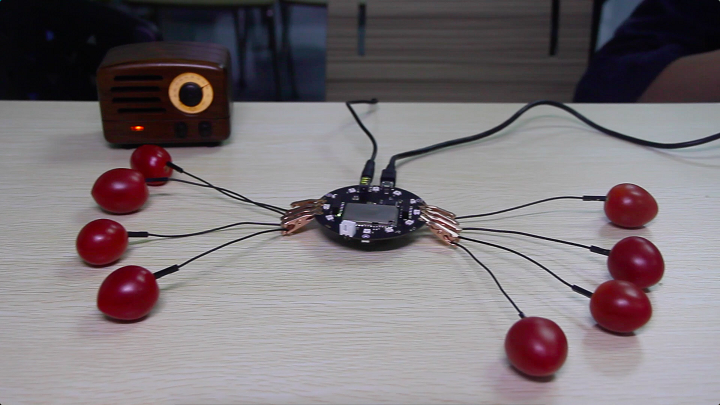

ReSpeaker Tomato Piano
======================

The project creates a touch sensing piano with tomato (as well as other fruit).

### Getting Started
1. `git clone https://github.com/respeaker/piano.git` # On ReSpeaker, download the repository 
2. Download [ReSpeaker Arduino Library](https://github.com/respeaker/respeaker_arduino_library)
3. Upload [piano.ino](arduino/piano.ino) to ReSpeaker's Arduino Leonardo (ATmega32U4)
4. Run `python piano.py` on ReSpeaker's serial console

